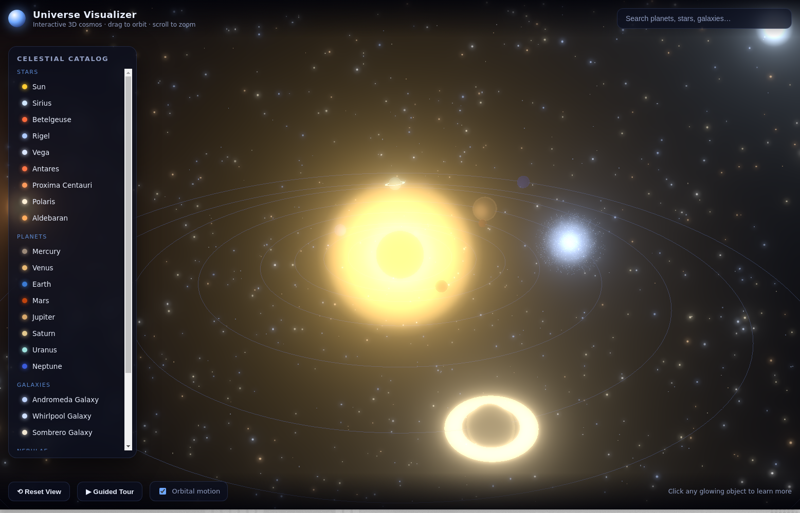

# Universe Visualizer

An interactive, real-time **3D visualization of the universe**, built with
[Three.js](https://threejs.org/) + WebGL and TypeScript. Explore the Solar
System, famous stars, galaxies, nebulae and star clusters in a smooth,
GPU-accelerated environment — zoom, orbit, pan, search and click any object to
read curated facts about it.



## Features

- **Real-time 3D scene** rendered with WebGL via Three.js, with HDR-style
  **bloom post-processing** for a glowing, cinematic look.
- **The Solar System** — the Sun and all eight planets with tuned colors,
  inclined orbits, axial spin, rings (Saturn & Uranus) and atmospheric shells.
- **Famous stars** — Sirius, Betelgeuse, Rigel, Vega, Antares, Proxima
  Centauri, Polaris and Aldebaran, each as a twinkling, clickable beacon.
- **Deep-sky objects** — procedurally generated spiral galaxies (Andromeda,
  Whirlpool, Sombrero), volumetric-style nebulae (Orion, Eagle, Helix) and the
  Pleiades star cluster.
- **9,000-star background field** surrounding the viewer at every zoom level.
- **Interactive controls**
  - Drag to orbit · scroll/pinch to zoom · right-drag to pan (OrbitControls).
  - Hover for object name tooltips; click any object to open its detail panel.
  - **Fly-to** camera tweening that smoothly frames the selected object.
  - **Searchable catalog** and a grouped sidebar navigator.
  - **Guided tour** that auto-flies through highlights of the cosmos.
  - Toggle orbital motion and reset the view at any time.
- **Responsive, accessible UI** that adapts from desktop to mobile.

## Tech stack

| Concern        | Choice                                    |
| -------------- | ----------------------------------------- |
| Rendering      | Three.js (WebGL), UnrealBloom post-FX     |
| Language       | TypeScript                                |
| Build tool     | Vite                                      |
| Data           | Curated, real astronomical facts (static) |

No API keys or backend are required — everything runs client-side.

## Getting started

```bash
npm install
npm run dev      # start the dev server (http://localhost:5173)
```

### Production build

```bash
npm run build    # type-check + bundle into dist/
npm run preview  # preview the production build
```

## Project structure

```
src/
  data/          curated astronomical data (planets, stars, deep-sky)
  scene/         Three.js building blocks
    SceneManager.ts   renderer, camera, OrbitControls, bloom composer
    Starfield.ts      background star field
    SolarSystem.ts    Sun + orbiting planets
    BrightStars.ts    famous named stars
    DeepSky.ts        galaxies, nebulae, clusters
    textures.ts       procedural canvas textures (glow, nebula)
  ui/UI.ts       DOM overlay: info panel, search, navigator, tooltip
  Universe.ts    orchestrates the scene, raycasting, camera & UI
  main.ts        entry point
```

## Controls reference

| Action            | Input                                  |
| ----------------- | -------------------------------------- |
| Orbit camera      | Left-click + drag                      |
| Zoom              | Mouse wheel / pinch                    |
| Pan               | Right-click + drag                     |
| Select object     | Click an object or a catalog entry     |
| Fly to object     | "Fly to object" button in detail panel |
| Guided tour       | "Guided Tour" button                   |
| Reset view        | "Reset View" button                    |

## License

MIT
